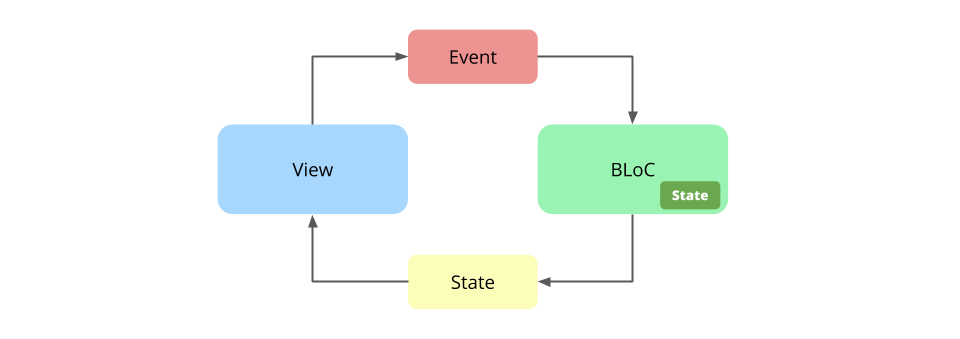
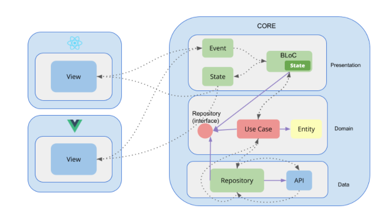

# An scalable, sacrificial and modular frontend architecture. The architecture design makes It easy be turned into micro-fronted when requirements arise. (WIP)

## Clean Architecture

Clean architecture is a software design philosophy that separates the elements of a design into ring levels. An important goal of clean architecture is to provide developers with a way to organize code in such a way that it encapsulates the business logic but keeps it separate from the delivery mechanism.
For more details, check out this article - [The Clean Architecture](https://blog.cleancoder.com/uncle-bob/2012/08/13/the-clean-architecture.html)

## BLoC pattern

Generally speaking, BLoC (**B**usiness **L**ogic **C**omponent) is a design pattern enabling developers to efficiently and conveniently manage state across their apps without a tight coupling between the presentation (view) and the logic. It also aims for reusability of the same logic across multiple widgets. For more details, check out this article - [What is the BLoC pattern?](https://www.flutterclutter.dev/flutter/basics/what-is-the-bloc-pattern/2021/2084/)

## Clean Architecture and BLoC design pattern

When you use BLoC with Clean Architecture, it makes more sense to call them PLoC (Presentation Logic Component). For more details, check out this article - [moving away from framework on frontend using clean architecture](http://xurxodev.com/frontend-clean_architecture/)

